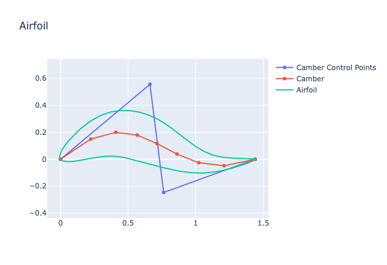
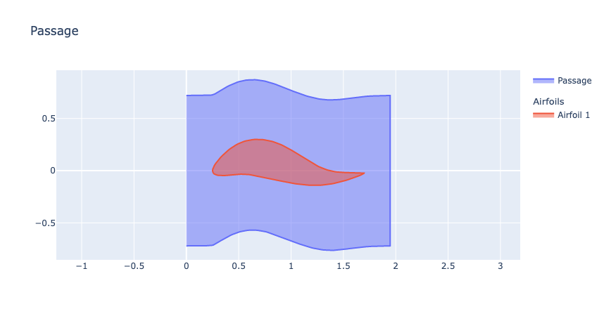

<p align="center">
    
</p>

<p align="center">the open source parametric airfoil generator</p>


# About
ParaFoil is a declarative tool that parametrically generates turbomachinery and aircraft airfoils and passages with B-splines. The purpose is to generate airfoil shapes from different parameters during fluid simulation optimizations.


# Install
```
pip install git+https://github.com/Turbodesigner/parafoil.git#egg=parafoil
```

## Other Versions
```
# Version 1
pip install git+https://github.com/Turbodesigner/parafoil.git@1.0.0#egg=parafoil
```

# Example

## Airfoil
```python
import numpy as np
from parafoil import CamberThicknessAirfoil

airfoil = CamberThicknessAirfoil(
    inlet_angle=np.radians(40.0),
    outlet_angle=np.radians(-20.0),
    stagger_angle=np.radians(0.0),
    upper_thick_prop=[0.035, 0.14, 0.14, 0.035, 0.007],
    lower_thick_prop=[0.035, 0.14, 0.14, 0.035, 0.007],
    leading_prop=0.5,
    trailing_prop=0.5,
    chord_length=1
)

airfoil.visualize(include_camber_ctrl_pnts=True)
```


## Passage
```python
from parafoil import TurboRowPassage 

passage = TurboRowPassage(
    airfoil=airfoil,
    spacing_to_chord=1.0,
    leading_edge_gap_to_chord=0.25,
    trailing_edge_gap_to_chord=0.25,
)
passage.visualize()
```




# Devlopement Setup
```
git clone https://github.com/Turbodesigner/parafoil.git
cd parafoil
pip install -r requirements_dev.txt
```

# Help Wanted
Right now there are some items such as CFD meshing and adding more shaping. Please join the [Discord](https://discord.gg/H7qRauGkQ6) for project communications and collaboration. Please consider donating to the [Patreon](https://www.patreon.com/openorion) to support future work on this project.

